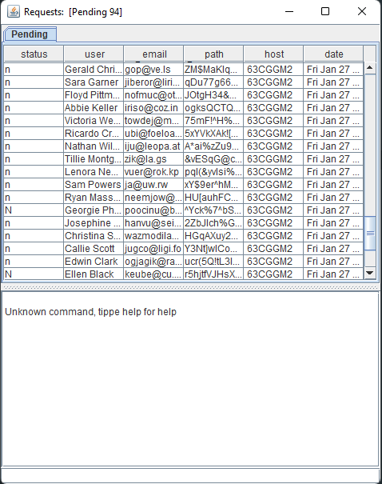

# Administration

This is a Bot:

- taking information from CSV file (staus(n=Pending/ t=Approved/ f=Rejected), name, email, requestTag).
  - new Request start with Pending and get sorted by the status
- create a jFrame with true and false pane.
- list all information inside and updating the frame all 10sec.

Client Class:
- allows to create new entries for the csv file (create a new request)

Connector:
 - not Finish yet!
 - for interact via networks (local)
 
connection Interface:
 - for better communication between the classes
 
For what you can use it:
- gathering information for the Administration from employees.
- improve the code and make a Ticket system out of it.
- use it for monitoring a file (in this case a csv file)

Request Frame that lists all requests (n=Pending/ t=Approved/ f=Rejected):

Request Frame for the new request (Pending):

Frame for a new Request:

